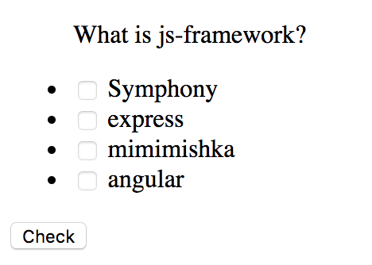
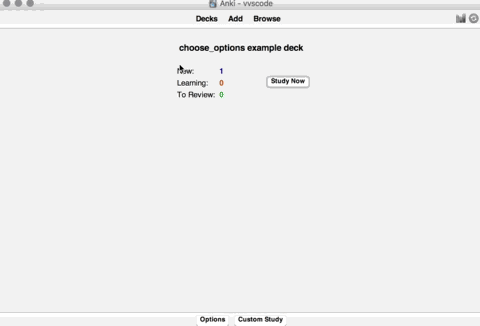

# Choose options

It should provide some description text and number of options. Some of them should be chosen for the correct answer, others - not.

## Logic

On rendering card:

1. Shuffle all options to change an order for each interaction
1. Show button which allows checking if the current set is correct

## Example:

```
> What is js-framework?
- [x] express
- [x] angular
- [ ] mimimishka
- [ ] Symphony
```

Should give a card with 4 checkboxes and a single button to check.



## Example card

```javascript
{
  type: 'choose_options',
  lang: 'en',
  tags: [
    'development',
    'patterns',
  ],
  card: {
    question: 'What is `I` in SOLID?',
    answers: [
      {
        text: 'Interface segregation',
        correct: true,
      },
      {
        text: 'Immutable',
      },
      {
        text: 'Intelligent decoupling',
      },
      {
        text: 'International',
      },
      {
        text: 'Infrastructural improvements',
      },
    ],
    comment: '<b>Interface-segregation principle (ISP)</b> states that no client should be forced to depend on methods it does not use.    <br /><i>"many client-specific interfaces are better than one general-purpose interface."</i>',
  },
}
```


