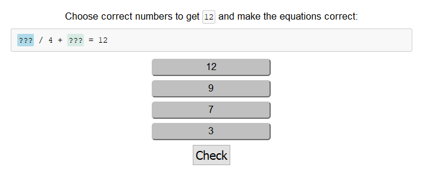
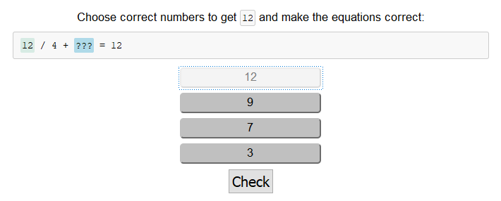
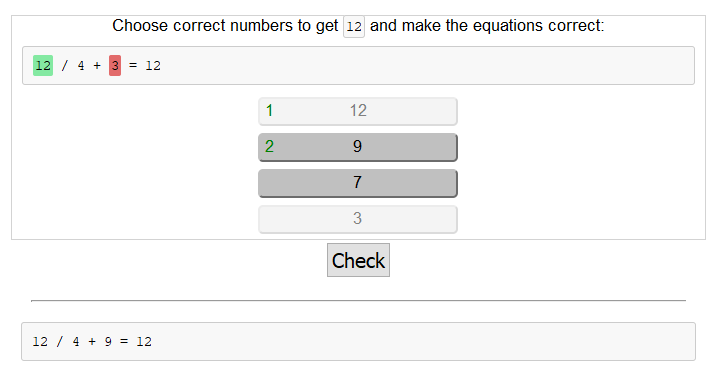
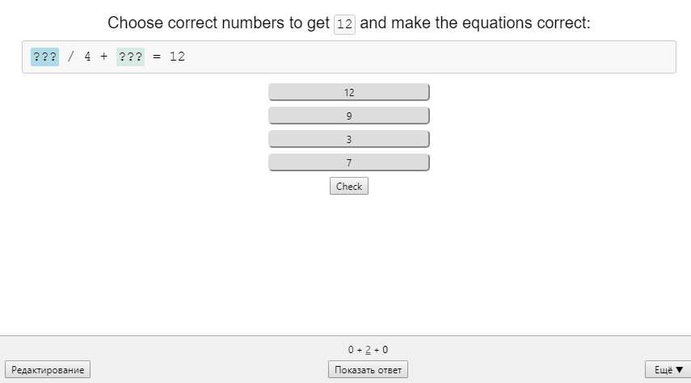

<!-- @format -->

# Choose sequence

This card shows some description text and number of options. Some of them should be chosen for the correct answer, others - not but it should be done in the right order.

## Logic

On rendering card:

1. All the options are shuffled to change the order of them on each try;
1. There are displayed proposed options as buttons which may be pushed;
1. If user selects one of the button the active `???` placeholder will be replaced with selected button's text and button will become disabled. The replacing order corresponds the order of `???` in question;
1. If user decides to cancel already selected option he should click (touch) desired placeholder in the card question. Clicked placeholder will be replaced with `???` and corresponding button become enabled.
1. Check button allows checking if the current set is correct. All correct answers are marked with `green` color, incorrect or unselected options will be marked with `red` color. Correct order sequence number will be displayed on the left of the button.

## Example:

```
> Choose correct numbers to get 12 and make the equation correct:
> ??? / 4 + ??? = 12
- [ ] 12
- [ ] 9
- [ ] 7
- [ ] 3
```

Should give a card with shuffled 4 buttons and a single button to check.





## Example card

- The amount of placeholders `???` should be less than amount of proposed answers.
- The format of the card considers first `n` options as the correct sequence answer, where `n` - is the amount of `???` placeholders in the card question. For the card example below correct sequence of the answers will be `12` then `9`.
- It might be helpful to know that card `question` and `answers` should be described in html format. Every usage of `<code>` and `<pre>` tag at these fields will display inline and multiline code fragment respectively. Multiline code fragment saves formatting - tabs and new line symbols.

```javascript
{
  type: 'choose_sequence',
  lang: 'en',
  tags: ['mathematics'],
  card: {
    question: 'Choose correct numbers to get <code>12</code> and make the equations correct:<br/>\
    <pre>??? / 4 + ??? = 12</pre>',
    answers: [
      {
        text: '12'
      },
      {
        text: '9'
      },
      {
        text: '3'
      },
      {
        text: '7'
      }
    ],
    comment: '<pre>12 / 4 + 9 = 12</pre>'
  }
}

```


