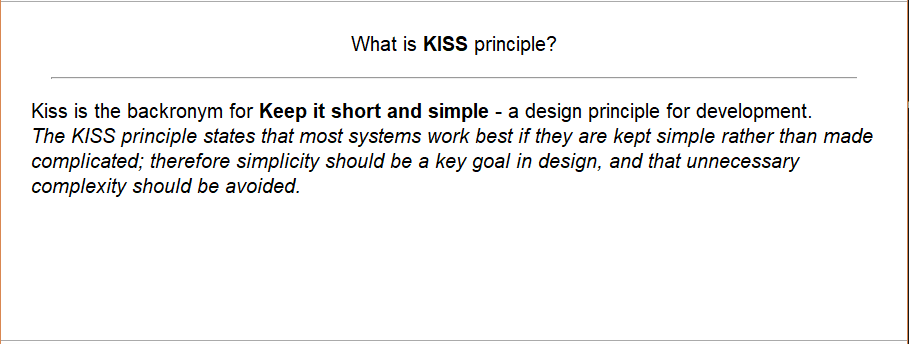

# Information card

It's the simpliest type of cards which is mostly used at Anki.
This card provides some information: there can be a abbriviation or question to user which has an explanation or answer on the back of the card.


## Example:

```
> What is KISS principle?
```

Should give a card with text on front side and answer on the other side.




## Example card

```javascript
{
  type: 'info',
  lang: 'en',
  tags: [
    'development',
    'patterns',
  ],
  card: {
    question: 'What is KISS principle?',
    comment: 'Kiss is the backronym for <b>Keep it short and simple</b> - a design principle for development.<br /><i>The KISS principle states that most systems work best if they are kept simple rather than made complicated; therefore simplicity should be a key goal in design, and that unnecessary complexity should be avoided.</i>',
  },
}
```
