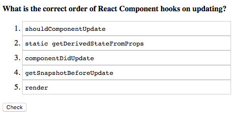

# Choose options

It should provide some description text and number of options. User have to sort options in proper order.

## Logic

On rendering card:

1. Shuffle all options to change an order for each interaction
1. Show button which allows checking if the current set is correct

## Example:

```
> Sort letters to get `SOLID`?
- O
- L
- S
- I
- D
```

Should give a card with 5 sortable lines and button to check.



## Example card

```javascript
{
  type: 'order_items',
  lang: 'en',
  tags: ['development', 'patterns'],
  card: {
    question: 'Order items to get a <b>SOLID</b>',
    answers: [
      "a class should have only a single responsibility (i.e. changes to only one part of the software's specification should be able to affect the specification of the class)",
      "software entities … should be open for extension, but closed for modification.",
      "objects in a program should be replaceable with instances of their subtypes without altering the correctness of that program.",
      "many client-specific interfaces are better than one general-purpose interface.",
      'one should "depend upon abstractions, [not] concretions."'
      ],
    comment: '<b>SOLID</b> is: <ol>\
    <li>Single responsibility principle</li>\
    <li>Open/closed principle</li>\
    <li>Liskov substitution principle</li>\
    <li>Interface segregation principle</li>\
    <li>Dependency inversion principle</li>\
    </ol>',
  },
}
```


